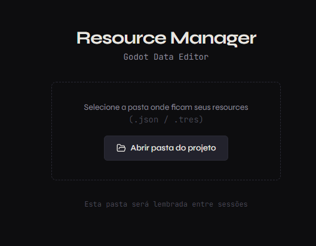
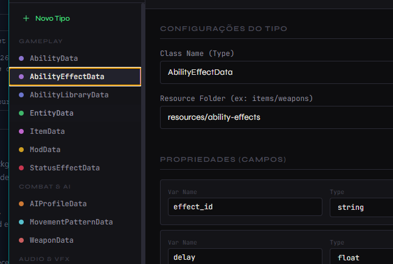
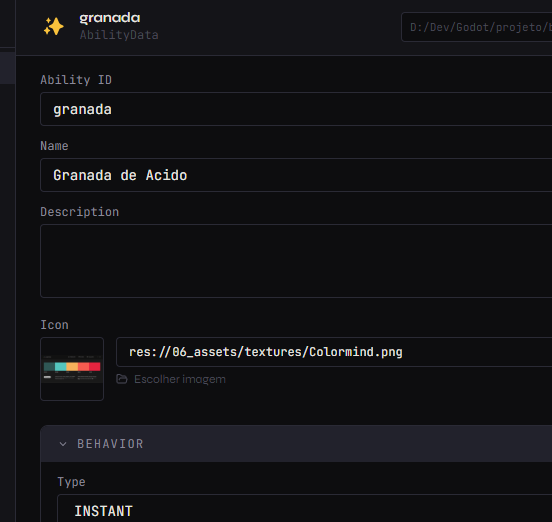

# Godot Resource Manager (GRM)

O **Godot Resource Manager** é uma ferramenta desktop poderosa, construída com Electron e React, projetada para simplificar a criação, edição e gerenciamento de arquivos de dados (JSON) e recursos do Godot Engine. Ele oferece uma interface amigável para carregar schemas dinâmicos, editar propriedades e exportar automaticamente para `.tres` e `.gd`.

---

## ✨ Principais Funcionalidades

- **Gerenciamento de Schemas Dinâmicos**: Defina estruturas de dados (schemas) em JSON sem precisar recompilar a ferramenta.
- **Edição Visual de Recursos**: Interface intuitiva para editar propriedades com suporte a diversos tipos de dados (String, Int, Float, Color, Vector3, File, etc.).
- **Exportação Automática**: Converta seus dados JSON para recursos nativos do Godot (`.tres`) e gere scripts GDScript (`.gd`) automaticamente.
- **Organização Flexível**: Escolha pastas de destino personalizadas para seus recursos.
- **Integração com Godot**: Trabalhe diretamente na pasta do seu projeto.

---

## 🚀 Começando

### 1. Abrindo seu Projeto

Ao iniciar o aplicativo, selecione a pasta raiz do seu projeto Godot. Isso permite que o GRM escaneie e gerencie os arquivos no contexto correto.



### 2. Criando Schemas

Defina os tipos de dados que seu jogo precisa (Inimigos, Itens, Habilidades) através do editor de Schemas. Você pode configurar campos, tipos, valores padrão e ícones.



### 3. Editando Recursos

Com os schemas definidos, crie e edite os recursos do jogo. A interface gera formulários baseados nos seus schemas, facilitando o preenchimento de dados complexos.



---

## 🛠️ Instalação e Execução

### Pré-requisitos

- [Node.js](https://nodejs.org/) 18+
- npm 9+

### Instalação

Clone o repositório e instale as dependências:

```bash
npm install
```

### Desenvolvimento

Para rodar em modo de desenvolvimento com hot-reload:

```bash
npm run dev
```

### Build

Para gerar o executável (.exe) da aplicação:

```bash
npm run dist
```

O arquivo executável será gerado na pasta `dist/`.

---

## 📦 Estrutura de Arquivos

A ferramenta organiza os dados da seguinte forma no seu projeto Godot:

- **.schemas/**: Pasta oculta na raiz do projeto onde ficam as definições de schemas (`.json`) e os dados brutos (`data/`).
- **resources/** (ou customizado): Pasta onde os arquivos `.tres` e scripts `.gd` são exportados para uso no Godot.

---

## 📝 Formato do Schema

Exemplo de um arquivo de definição de schema (`.json`):

```json
{
  "type": "EnemyData",
  "label": "Enemy",
  "emoji": "👾",
  "color": "#e11d48",
  "folder": "resources/enemies",
  "fields": [
    { "key": "name", "label": "Name", "type": "string" },
    { "key": "health", "label": "Max Health", "type": "int", "default": 100 },
    { "key": "speed", "label": "Speed", "type": "float", "default": 5.0 },
    { "key": "sprite", "label": "Sprite", "type": "image" }
  ]
}
```

---

*Desenvolvido para agilizar o fluxo de trabalho de dados no Godot Engine.*
